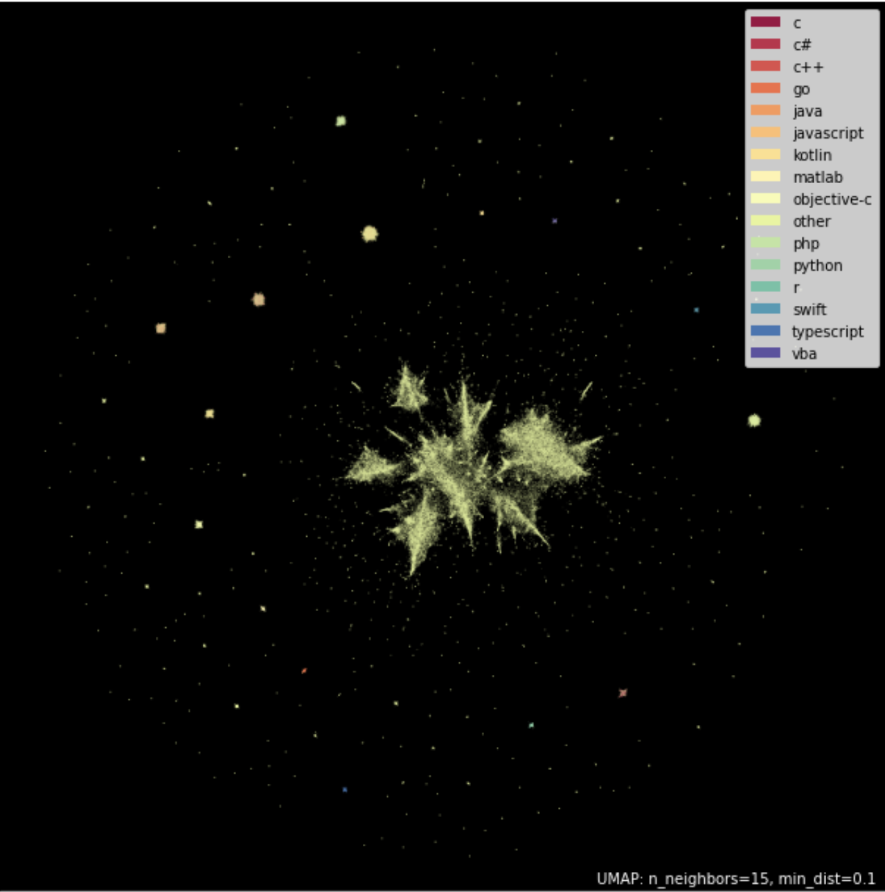

# Mapping Programming Languages with Stack Overflow Data 

This project is an **experimental visualization** I carried out during university (around 4 years ago).  
The goal was to explore whether programming languages and technologies could be arranged on a **map**, such that languages used in similar contexts appear closer together.

---

## Idea

- Collected a large dataset of **Stack Overflow posts** (tags and post content).
- Represented the data in multiple ways to capture relationships between languages.
- Applied **UMAP (Uniform Manifold Approximation and Projection)**, **t-SNE (t-distributed Stochastic Neighbor Embedding)**, and **K-Means clustering** for dimensionality reduction and clustering.  
- Visualized the resulting embeddings/clusters in 2D to create a "map of programming."

---

## Experiments

- Tested several approaches to represent the data.
- Ran multiple experiments using UMAP, t-SNE and K-Means, tuning hyperparameters extensively.
- Found **UMAP** to produce the best results.  
- Investigated whether related languages (e.g., C, C++, and C#) or domains (e.g., web vs. systems programming) would cluster together.  

---

## Results

Some of the results revealed several interesting patterns:

- In some experiments, languages used in similar ways often appeared **closer together**.  
- Certain domains (e.g., web-related tags) tended to form clusters.  
- Some languages stood out as isolated due to their more niche or domain-specific usage.  
- The experiment highlighted both the promise and the challenges of trying to "map" programming ecosystems from community data.  

  

---

## Notes

- This was a **fun side project**, not a polished research pipeline.  
- The code and exact preprocessing details were sadly not preserved.  
- What remains is this visualization, which captures the essence of the idea.   

---
